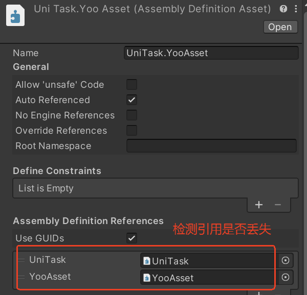

# UniTask 扩展

### 代码示例

```csharp
using System;
using UnityEngine;
using YooAsset;
using Cysharp.Threading.Tasks;

public class TestTask : MonoBehaviour
{
    private async void Start()
    {
        var assetHandle = YooAssets.LoadAssetAsync<GameObject>("UIHome");
        await assetHandle.ToUniTask();
        Debug.Log($"{assetHandle.Status}");
    }
}
```

### 使用教程A

1. 下载 [UniTask](https://github.com/Cysharp/UniTask) 源码并导入到工程内。

2. 修改UniTask源码

   UniTask/Runtime/_InternalVisibleTo.cs

   ```csharp
   using System.Runtime.CompilerServices;
   
   [assembly: InternalsVisibleTo("UniTask.Linq")]
   [assembly: InternalsVisibleTo("UniTask.Addressables")]
   [assembly: InternalsVisibleTo("UniTask.DOTween")]
   [assembly: InternalsVisibleTo("UniTask.TextMeshPro")]
   [assembly: InternalsVisibleTo("UniTask.YooAsset")] //增加此行代码
   ```

3. 拷贝YOO提供的扩展脚本到工程内。

   YooAssets/Samples/UniTask Sample/UniTask目录

4. 添加引擎里的宏定义（在宏定义未生效的情况下）

   Project Settings --> Player --> Scripting Define Symbols

   ```
   UNITASK_YOOASSET_SUPPORT
   ```

5. 重启Unity引擎

   重新打开工程后用上面的代码示例验证，看下是否有编译错误！

### 使用教程B

1. 通过Package导入UniTask插件

2. 拷贝YOO提供的扩展脚本到工程内。

   YooAssets/Samples/UniTask Sample/UniTask目录

   YooAssets/Samples/UniTask Sample/UniTaskRef目录

3. 添加引擎里的宏定义（在宏定义未生效的情况下）

   Project Settings --> Player --> Scripting Define Symbols

   ```
   UNITASK_YOOASSET_SUPPORT
   ```

4. 重启Unity引擎

   重新打开工程后用上面的代码示例验证，看下是否有编译错误！

### 注意事项

- 注意检测程序集引用是否丢失

